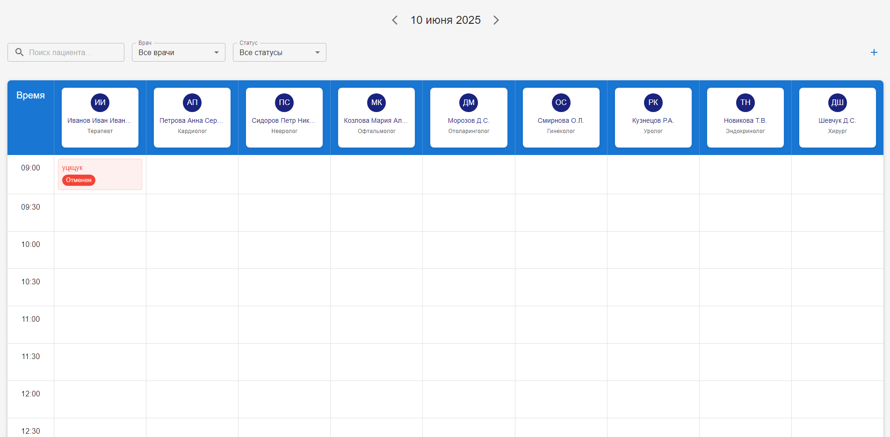
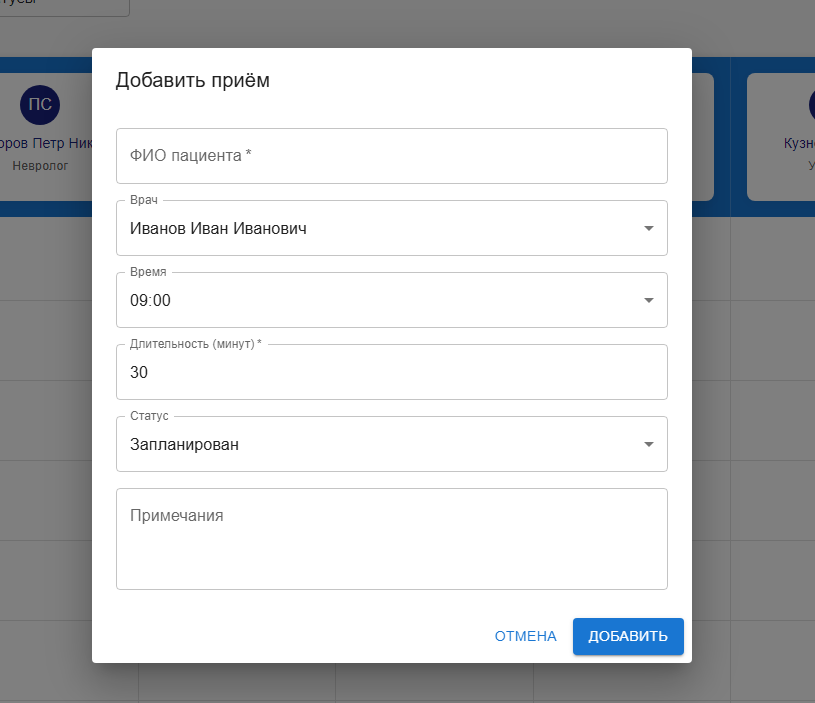
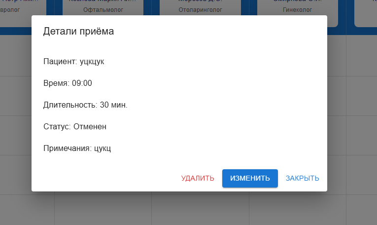
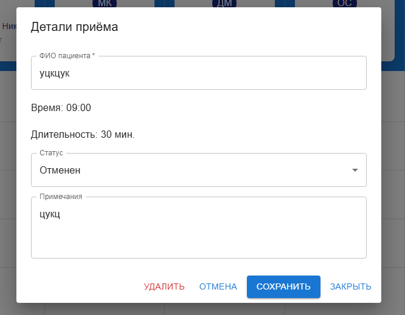

# Расписание клиники

Веб-приложение для управления расписанием приёмов в клинике.

## Функциональность

- Просмотр расписания приёмов по дням
- Добавление новых приёмов
- Редактирование существующих приёмов
- Удаление приёмов
- Фильтрация по врачам и статусам
- Поиск по имени пациента
- Сохранение данных в localStorage

## Технологии

- React
- TypeScript
- Material-UI
- date-fns

## Скриншоты

### Главный экран



### Добавление приёма



### Детали приёма



### Редактирование приёма



## Установка и запуск

1. Клонируйте репозиторий
2. Установите зависимости:

```bash
yarn install
```

3. Запустите приложение:

```bash
yarn start
```

## Структура проекта

```
src/
  ├── components/         # React компоненты
  ├── types/             # TypeScript типы
  ├── constants/         # Константы и данные
  ├── hooks/             # Пользовательские хуки
  └── App.tsx           # Корневой компонент
```
